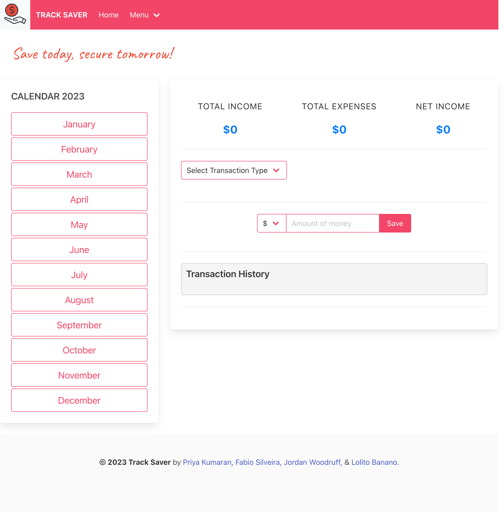

# TRACK_SAVER
## Description
Track_Saver is a web application designed to help users track their income, expenses, and savings, making it easier to manage their financial goals.
## Table of Contents
- [Installation](#installation)
- [Usage](#usage)
- [Features](#features)
- [License](#license)
- [Contributing](#contributing)
- [Tests](#tests)
- [Questions](#questions)
- [Screen-shots](#screen-shots)
## Installation
To run this application locally, follow these steps:
1. Clone the repository to your local machine:
    git clone https://github.com/yourusername/track-saver.git
2. Install the project dependencies:
    cd TRACK_SAVER
    npm install
3. Create a `.env` file in the project root and add your environment variables (e.g., database credentials, session secrets).
4. Set up your database and configure `config/config.json` with your database details.
5. Run the application:
    npm start
6. Open your web browser and navigate to `http://localhost:3001` to access the application.
## Usage
Once you have the application up and running, follow these steps:
1. Register for an account or log in if you already have one.
2. After logging in, you will be able to see three categories: Income, Expense, and Savings.
3. Use the Income category to input your income sources, including the source name and amount.
4. Use the Expense category to input your expenses, including the category and amount.
5. The application will calculate your savings by subtracting your total expenses from your total income.
6. Keep track of your financial progress and savings goals using Track_Saver!
## Features
-User authentication and registration.
-User-friendly interface for adding income and expenses.
-Real-time calculation of savings.
-User dashboard for tracking financial data.
-Responsive design for mobile and desktop.
## License
This project is licensed under the MIT License.
## Contributing
Contributions are welcome!
## Tests
No tests are currently provided for this project.

## Questions      -our GitHub accounts
https://github.com/priyakumi/TRACK_SAVER

## Screen-shots
.png>)com_.png)

